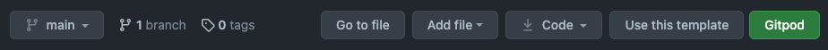
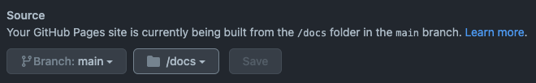

# Project Template

This project template helps you to easily create a dedicated website for projects in the [OntoUML](https://github.com/OntoUML) organization.

## How to Start

How about turning your markdown files into beautiful webpages to better document and advertise your project. Just follow these steps and you'll be ready in no time.

### First Step - Create a New Repository

Start by creating a new repository based on this template by clicking on [`Use this template`](https://github.com/OntoUML/project-template/generate) at the top of the repository's page. This creating a new repository keeping all files and folder contained in this one.



These folders and files have the following roles:

```
.
├── _layouts           # folder containing the custom layout used in the OntoUML organization
├── .github            # folder containing the necessary actions to build your website
├── assets             # folder containing assets for the the website's style
├── docs               # folder containing the generated website
├── _config.yml        # file containing all Jekyll configurations
├── 404.md             # file used to generate "Not Found" pages
├── Gemfile            # Ruby configuration file used for Jekyll
├── Gemfile.lock       # Ruby configuration file used for Jekyll
```

If you are not familiar with [Jekyll](https://jekyllrb.com/) there is not need to modify any of these files, but once they are part of repository you are free to use them to best fit your needs.

### Second Step - Setting Up The Repository

Go to your repository settings under `Settings > Pages` and change the `Source` branch to `main` and the folder next to it to `/docs`.



### Third/Final Step - Write That Markdown!

Jekyll now will generate webpages based on every markdown file in your project. By default, the `README.md` in your project's root become the "homepage" of your project and it'll be made available in the following URL: [https://ontouml.github.io/YOUR-PROJECTS-NAME/](https://ontouml.github.io/project-template/).

Every other page's URL will be a combination of this base URL, the markdown file's name, and the name of the folders it is within.

```txt
about.md              >   https://ontouml.github.io/YOUR-PROJECTS-NAME/about
instructions.md       >   https://ontouml.github.io/YOUR-PROJECTS-NAME/instructions
tests/README.md       >   https://ontouml.github.io/YOUR-PROJECTS-NAME/tests/
tests/test-setup.md   >   https://ontouml.github.io/YOUR-PROJECTS-NAME/tests/test-setup
```

Now everything is ready. Your project's website will be updated shortly after you push your commits to the `main` branch. Enjoy!

## Hints and Tricks

### Updating Configurations

Even though unnecessary, you may want to update a couple of variables in Jekyll's configurations. If you want to learn more about them, have a look at [Jekyll's instructions](https://jekyllrb.com/docs/configuration/options/).

```yml
title: <Your Project's Title>
description: <Your Project's Description>
exclude:
  - "<folder or file that you don't want to be part of your website>"
```

### Testing Locally

If you have Ruby installed in your machine, you can check your project's website before it goes live. Just go to the project's folder in your terminal and run the following command:

```zsh
bundler install   # run only the first time
bundler exec jekyll serve -o   # the '-o' flag asks Jekyll to automatically open the website in your default browser
```

### Using HTML

Jekyll will build your site using not only markdown files in your repository, but HTML files as well. More interesting even, you can add snippets of HTML to your markdown files to boost them. For example, how about adding a video with auto-resizing?

```html
<div>
  <iframe style="width: 100%; height: 400px;"
    src="https://www.youtube.com/embed/rKFOEt8ogLw"
    title="YouTube video player"
    frameborder="0"
    allow="accelerometer; autoplay; clipboard-write; encrypted-media; gyroscope; picture-in-picture"
    allowfullscreen/>
</div>
```

<div>
  <div>
  <iframe style="width: 100%; height: 400px;"
    src="https://www.youtube.com/embed/rKFOEt8ogLw"
    title="YouTube video player"
    frameborder="0"
    allow="accelerometer; autoplay; clipboard-write; encrypted-media; gyroscope; picture-in-picture"
    allowfullscreen/>
</div>
</div>
